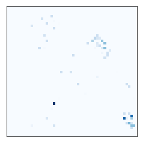
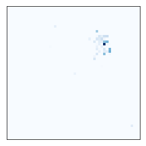
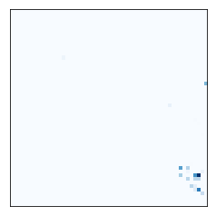
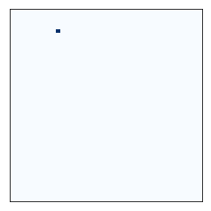
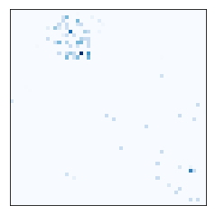

# Developer Similarity

This is a legacy from [source{d}](http://www.sourced.tech/)'s research in developer similarity when its main goal was to [match developers and companies](http://web.archive.org/web/20161020170426/http://sourced.tech/).
We were obsessed with developer embeddings and recommending similar ones. Not everything we created
is included here. For now, it's the profile images to visually compare the experience.

source{d} runs a massive-scale data retrieval pipeline that among other sources nearly mirrors all GitHub repositories.
Everything related to working with developer metadata requires understanding which email addresses correspond
to which GitHub users. [GitHub ToU](https://help.github.com/articles/github-terms-of-service/) directly forbids to use API for recruitment purposes which at the time we had, so there was no easy way to obtain that information.

Luckily, we were able to perform identity matching using various heuristics for Git commit signatures. For example, given two different signatures with the same name in the same repository, it is likely that the different email addresses belong to the same user.
We never measured the accuracy of our heuristics - back then we were a humble startup - but our CTO claims that it worked reasonably well in practice.

Given the [topic modeling results](https://arxiv.org/abs/1704.00135), we were able to cluster 6 millions
of filtered repositories with K-means algorithm ([src-d/kmcuda](https://github.com/src-d/kmcuda)) into a
reasonable number of clusters, in our particular case 2916. We arranged those clusters using t-SNE
and mapped into a regular 54x54 = 2916 grid and described the latter in the [blog post](https://blog.sourced.tech/post/lapjv/).
Thus every repository appears in a single specific cell of that grid.

Given the identity matching, we had the contribution history and could even roughly estimate the impact as the ratio of
contributed commits to the whole number of commits in the main branch of a project. We color the corresponding
cell for each weighted contribution by the chosen user and compose the profile image. As an example, this is how our CTO [Máximo Cuadros](https://github.com/mcuadros) developer fingerprint looks like under this approach:

We see PHP trace in the upper right area and Go trace in the lower right.

This is [Fabien Potencier](https://github.com/fabpot), the man behind [Symfony](https://symfony.com/) PHP framework:

We see the strong PHP trace. Thus looking on both profiles we see that Máximo and Fabien have something in common -
they both have experience in PHP.

This is [Russ Cox](https://github.com/rsc), one of the creators of [Go](https://golang.org/) language:

We see the strong Go trace. Thus looking on his and Máximo's profiles we see that they have something in common -
they both have experience in Go.

At the same time, the profile images are not limited to languages. It just happens so that each language has some
common usage patterns and people with much experience follow all of them. For example, this is
[François Chollet](https://github.com/fchollet), the author of [Keras](https://keras.io/),
the deep learning Python library:

Just a few pixels. In contrast, this is [Armin Ronacher](https://github.com/mitsuhiko),
a well known universal Python developer:

There is an expressed Python trace + web development. We see that François always contributes very specific things.
At the same time, Python deep learning pixels reside in the cloud of Python related projects.

### License

Apache 2.0.

